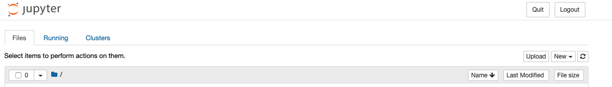
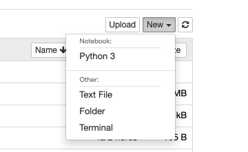
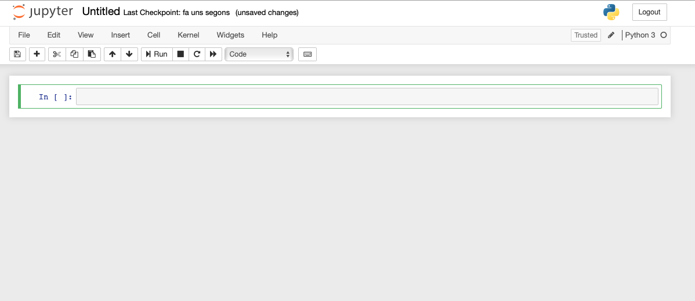

# Data Processing Environments with Python

Before we start developing any code, we will overview which are the most common ways of processing data using the Python ecosystem.

## What you will learn in this Laboratory
* What are the main basic tools to process data in a computer
* What are the most commonly used environments within the Python data community
* Configure and run the environments proposed
* What are the differences between the proposed environments
* When to use each of the proposed environments
  
## Outline
1. (What is a Data Processing Environment)[laboratories/lab0_data_processing_envs/data_processing_envs.md#what-is-a-data-processing-environment]
2. Overview of the different Python Environment configurations
   1. Python Virtual Environments
   2. Pipenv
   3. Conda
   4. Docker
3. Configuring a Pipenv environment
4. Configuring a Conda environment
5. Configuring a Docker environment
6. Running code in different environments
7. Other environments

## Before we start
We will learn how to set up different environments for computing, but we will assume that you currently have a Python interpreter installed in your computer.

In case you don't have any interpreter yet, we will learn how to install Python environments, so if you can't test/try a proposed action, go back to there when you learnt how to install one.

In case you have Docker installed you can run the following commands:
 > Download the latest Fedora container
 ```bash
  $ docker pull fedora
  Using default tag: latest
  latest: Pulling from library/fedora
  d318c91bf2a8: Pull complete 
  Digest: sha256:d4f7df6b691d61af6cee7328f82f1d8afdef63bc38f58516858ae3045083924a
  Status: Downloaded newer image for fedora:latest
  docker.io/library/fedora:latest
```
> Run the container interactivelly:
```bash
$ docker run -it fedora /bin/bash
[root@84853e881a84 /]# 
```

You can follow most of the tutorial using this environment.

## Content
### What is a Data Processing Environment
We will take the following definition:

> A Data Processing Environment is a collection of software tools that enable the execution of computer programs for data transformation and manipulation

We can highlight the following components as essential:
* Code interpreter or compiler
* Set of data processing libraries
* Text editor

Optionally we may want to use:
* Code debugger
* Integrated Development Environment
* Source version control tools

### Code interpreter
During all the course, the Python programming language will be the preferred language. Mainly we will try to use version 3.6, however it is possible that in some cases, due to dependency constraints we may be using other versions.

We can use the Python interpreter in two flavours:
* **Run as script:** basically we will provide the script (i.e. path to the script) and its parameters as arguments. The results can be shown through the terminal or saved to a disk. 
  
  Some useful options of the python interpreter:
  * `-c`option: you can pass the code as argument
  * `-i`option: after running the code the interpreter remains interactive with the execution environment active and loaded. To quit the interpreter you can write `quit()` or type `Ctrl-D`. 

If you have a python interpreter installed try the following (otherwise just follow the Lab until we see how to install a new one and the come back here):

> Run the interpreter passing the code as argument 
```
$ python -c "print('Hello world')"
```

> Run the interpreter passing the code and remaining interactive after the execution (the `>>>` means the expected interpreter output)
```
$ python -i -c "print('Hello world'); a = 0"
Hello world
>>> a
0
>>> 
```
* **Run interactively:** we can basically invoke the interpreter and then write the code interactively, this means that after each code block the interpreter will output the result and wait for the next code block.

```
$ python
>>> "Hello world"
'Hello world'
>>> a = 0
>>> a
0
>>> 
```

The main difference between the two running methods (in our concerning) is that each time we run a process as a script, we load data and we apply transformations from scratch each time.

If we run the code interactively, all data structures are loaded in memory and thus, we can transform the data from previous step without having to load it again.

### Text editor and Integrated Development Environments
We will not set preference in coding tools, however let's take a look at the different options:

* **Terminal text editor:** most of the Operating Systems have several editors that may be used in the terminal itself without the need of an external window. `vi`, `nano`, `emacs` are some examples of the most used editors. 
  * ***Pros:*** you can find them in almost any Unix-like operating system. They can be very useful if you want to make a small script or quick modifications. Essential if you do not have a graphical session. Really fast editing when you have a good knowledge.
  * ***Cons:*** not user friendly. They may require some learning before you can use it effectively. Hard to integrate in productive environments.

* **Graphical text editor:** these are raw text editors, where you can simply write code and save it. `gedit`, `notepad`, `textedit` are some examples. Normally all OS have a default text editor and they may be even configurable for programming or scripting. Beyond the default text editors we also can find a set of text editors that are specially developed for coding. 

  For example:
    * Sublime Text (https://www.sublimehq.com)
    * Atom (https://atom.io/)
    * Visual Studio Code (https://code.visualstudio.com/)

  These enhanced editors may include:
    * Syntax highlighting
    * Terminal and interpreter integration
    * Source control tools
    * Debugging tools
    * In general a lot of configurable settings

* **Integrated Development Environment:** these programs include all the tools for the development of a software project, ranging from code edition to deployment. They are quite big projects that led to heavy programs. Some examples of Python IDEs are:
  * PyCharm (https://www.jetbrains.com/pycharm/)
  * Eclipse (PyDev: https://www.pydev.org/)

* **Interactive Development Tools:** we have seen how can we use the Python interpreter to interactively run code. This programming paradigm is very useful when a programmer is developing a Data Centric application. 

  The main reason is that, as data is the most important asset, the programmer can run code to transform data, analyze, visualize, whilst maintaining the data into memory.

  There are some tools that may help to interactively develop code and provide insights and results.

    * **IPython**: it is a big project that contain multiple tools for interactive computing. One of its main goals is to provide interactive shell superior to Python’s default. 
      
      Quoting its docs: 
      > IPython has many features for tab-completion, object introspection, system shell access, command history retrieval across sessions, and its own special command system for adding functionality when working interactively. It tries to be a very efficient environment both for Python code development and for exploration of problems using Python objects (in situations like data analysis).

    * **Jupyter Notebooks:** IPython has a tool called Jupyter Notebooks or simply notebooks that allow the programmer to run code in a web browser using a rich interpreter. This interpreter is based in "cells" that can contain plain text or code. The Code cells can be run and the result is shown in the notebook.

    * **Spyder IDE:** another IPython feature is the kernel. Any IDE can connect to a IPython kernel so the editor code can be run in the kernel (i.e. IPython interpreter). Spyder mimics the layout of the popular programming environments RStudio and Matlab.

## Overview of the different configurations

Before we start the overview of the different proposal for creating a processing environment, let's try to understand the problem we will try to tackle.

 **What's wrong with my installed python version?** probably nothing. It's all right (I hope so).

 **So why do I need to setup different processing environments?** the problem are the libraries (modules and packages) you're going to need in the future and its dependencies.

 (*the following part is taken from the Python tutorial:* https://docs.python.org/3.6/tutorial/venv.html)

You may face several situations where you want to use different Python environments:
* An specific application needs a version different from the installed in your OS. Simply uninstalling the OS Python version is not a good idea as you may break many things.
* You want to use a module or a package that has a dependency of a specific version of another module or package, the requirements are in conflict.

There may be other situations where you may want to use different Python interpreters. The solution to this problem has been already added to the standard Python distribution.

Virtual environments, are self-contained directory trees that contain a Python installation for a particular version of Python, plus a number of additional packages.

Different applications can then use different virtual environments. To resolve the earlier example of conflicting requirements, application A can have its own virtual environment with version 1.0 installed while application B has another virtual environment with version 2.0. If application B requires a library be upgraded to version 3.0, this will not affect application A’s environment.

### Python Virtual Environments

As we said there's a module in the standard Python library called `venv`that will help us to create virtual environments (I will refer to virtual environment(s) as venv(s) ahead).

`venv` will usually install the most recent version of Python that you have available. 
 
If you have multiple versions of Python on your system, you can select a specific Python version by running python3 or whichever version you want.

#### Creating a Python Virtual Environment
To create a virtual environment, decide upon a directory where you want to place it, and run the venv module as a script with the directory path:

Normally is a good idea to create a directory named `.venv` and create venvs in there 

```
$ mkdir .venv
$ python3 -m venv tutorial-env
$ ls
tutorial-env
```

This will create the tutorial-env directory if it doesn’t exist, and also create directories inside it containing a copy of the Python interpreter, the standard library, and various supporting files.

```
$ ls tutorial-env/
bin             include         lib             pyvenv.cfg
```

Once we have the venv created we may want to run the python interpreted we've just created. To do so, we have to activate the environment first.

On Windows, run:

```
tutorial-env\Scripts\activate.bat
```

On Unix or MacOS, run:

```
$ source tutorial-env/bin/activate
```

Activating the virtual environment will change your shell’s prompt to show what virtual environment you’re using, and modify the environment so that running python will get you that particular version and installation of Python. For example:

```
$ source tutorial-env/bin/activate
(tutorial-env) $ python
Python 3.7.4 (default, Jul  9 2019, 16:32:37) 
[GCC 9.1.1 20190503 (Red Hat 9.1.1-1)] on linux
Type "help", "copyright", "credits" or "license" for more information.
>>> import sys
>>> sys.path
['', '/usr/lib64/python37.zip', '/usr/lib64/python3.7', '/usr/lib64/python3.7/lib-dynload', '/root/.venv/tutorial-env/lib64/python3.7/site-packages', '/root/.venv/tutorial-env/lib/python3.7/site-packages']
>>>
```

Let's compare to the base python interpreter in our OS. 

Let's deactivate the environment first.

```
(tutorial-env) $ deactivate
$ python
Python 2.7.16 (default, Apr 30 2019, 15:54:43) 
[GCC 9.0.1 20190312 (Red Hat 9.0.1-0.10)] on linux2
Type "help", "copyright", "credits" or "license" for more information.
>>> import sys
>>> sys.path
['', '/usr/lib/python27.zip', '/usr/lib64/python2.7', '/usr/lib64/python2.7/plat-linux2', '/usr/lib64/python2.7/lib-tk', '/usr/lib64/python2.7/lib-old', '/usr/lib64/python2.7/lib-dynload', '/usr/lib64/python2.7/site-packages', '/usr/lib/python2.7/site-packages']
>>>
```

We can see some differences in the `PYTHONPATH`, which now is pointing to some of the directories `venv`created.
  
#### Managing Packages with pip

There are several ways of adding modules and packages to a python interpreter (a.k.a install packages or modules). 

However, most of the time we would like to simply install a package or module from a repository. 

Pip is the preferred tool to install packages. By default pip will install packages from the Python Package Index, <https://pypi.org>. 

You can browse the Python Package Index by going to it in your web browser, or you can use pip’s limited search feature:

```
$ pip3 search data
data (0.4)                        - Work with unicode/non-unicode data from files or strings uniformly.
data-refinery (0.2.13)            - Data Refinery: transformating data
data-pack (0.0)                   - Data packages
data-analyze (1.4.1)              - data-analyze
.
.
.
```
#### Installing packages
You can install the latest version of a package by specifying a package’s name:

```
(tutorial-env) $ pip install pathlib
Collecting pathlib
  Downloading https://files.pythonhosted.org/packages/ac/aa/9b065a76b9af472437a0059f77e8f962fe350438b927cb80184c32f075eb/pathlib-1.0.1.tar.gz (49kB)
    100% |████████████████████████████████| 51kB 960kB/s 
Installing collected packages: pathlib
  Running setup.py install for pathlib ... done
Successfully installed pathlib-1.0.1
```

You can also install a specific version of a package by giving the package name followed by == and the version number:

```
(tutorial-env) $ pip install requests==2.6.0
Collecting requests==2.6.0
  Downloading https://files.pythonhosted.org/packages/73/63/b0729be549494a3e31316437053bc4e0a8bb71a07a6ee6059434b8f1cd5f/requests-2.6.0-py2.py3-none-any.whl (469kB)
    100% |████████████████████████████████| 471kB 3.1MB/s 
Installing collected packages: requests
Successfully installed requests-2.6.0
```

If you re-run this command, pip will notice that the requested version is already installed and do nothing. You can supply a different version number to get that version, or you can run pip install --upgrade to upgrade the package to the latest version:

```
(tutorial-env) $ pip install --upgrade requests
Collecting requests
  Downloading https://files.pythonhosted.org/packages/51/bd/23c926cd341ea6b7dd0b2a00aba99ae0f828be89d72b2190f27c11d4b7fb/requests-2.22.0-py2.py3-none-any.whl (57kB)
    100% |████████████████████████████████| 61kB 1.2MB/s 
Collecting chardet<3.1.0,>=3.0.2 (from requests)
  Downloading https://files.pythonhosted.org/packages/bc/a9/01ffebfb562e4274b6487b4bb1ddec7ca55ec7510b22e4c51f14098443b8/chardet-3.0.4-py2.py3-none-any.whl (133kB)
    100% |████████████████████████████████| 143kB 2.7MB/s 
Collecting idna<2.9,>=2.5 (from requests)
  Downloading https://files.pythonhosted.org/packages/14/2c/cd551d81dbe15200be1cf41cd03869a46fe7226e7450af7a6545bfc474c9/idna-2.8-py2.py3-none-any.whl (58kB)
    100% |████████████████████████████████| 61kB 5.1MB/s 
Collecting urllib3!=1.25.0,!=1.25.1,<1.26,>=1.21.1 (from requests)
  Downloading https://files.pythonhosted.org/packages/e0/da/55f51ea951e1b7c63a579c09dd7db825bb730ec1fe9c0180fc77bfb31448/urllib3-1.25.6-py2.py3-none-any.whl (125kB)
    100% |████████████████████████████████| 133kB 2.8MB/s 
Collecting certifi>=2017.4.17 (from requests)
  Downloading https://files.pythonhosted.org/packages/18/b0/8146a4f8dd402f60744fa380bc73ca47303cccf8b9190fd16a827281eac2/certifi-2019.9.11-py2.py3-none-any.whl (154kB)
    100% |████████████████████████████████| 163kB 2.4MB/s 
Installing collected packages: chardet, idna, urllib3, certifi, requests
  Found existing installation: requests 2.6.0
    Uninstalling requests-2.6.0:
      Successfully uninstalled requests-2.6.0
Successfully installed certifi-2019.9.11 chardet-3.0.4 idna-2.8 requests-2.22.0 urllib3-1.25.6
```

Note that pip will also resolve package dependencies, download and install them.

pip uninstall followed by one or more package names will remove the packages from the virtual environment.

#### Managing installed packages and modules
pip show will display information about a particular package:

```
(tutorial-env) $ pip show requests
Name: requests
Version: 2.22.0
Summary: Python HTTP for Humans.
Home-page: http://python-requests.org
Author: Kenneth Reitz
Author-email: me@kennethreitz.org
License: Apache 2.0
Location: /usr/lib/python2.7/site-packages
Requires: chardet, idna, urllib3, certifi
Required-by: 
```

pip list will display all of the packages installed in the virtual environment:

```
(tutorial-env) $ pip list
Package         Version 
--------------- --------
cson            0.7     
dbus-python     1.2.8   
gpg             1.12.0  
numpy           1.16.4  
olefile         0.46    
pandas          0.25.2  
pathlib         1.0.1   
Pillow          5.4.1   
pip             19.0.3  
Pygments        2.2.0   
PyQt5           5.13.1  
PyQt5-sip       4.19.19 
python-dateutil 2.8.0   
pytz            2019.3  
rpm             4.14.2.1
selinux         2.9     
sepolicy        1.1     
setools         4.1.1   
setuptools      40.8.0  
six             1.12.0  
speg            0.3     
```

pip freeze will produce a similar list of the installed packages, but the output uses the format that pip install expects. A common convention is to put this list in a requirements.txt file:

```
(tutorial-env) $ pip freeze > requirements.txt
(tutorial-env) $ cat requirements.txt
cson==0.7
dbus-python==1.2.8
gpg==1.12.0
numpy==1.16.4
olefile==0.46
pandas==0.25.2
pathlib==1.0.1
Pillow==5.4.1
Pygments==2.2.0
PyQt5==5.13.1
PyQt5-sip==4.19.19
python-dateutil==2.8.0
pytz==2019.3
rpm==4.14.2.1
selinux==2.9
sepolicy==1.1
setools==4.1.1
six==1.12.0
speg==0.3
```

The requirements.txt can then be committed to version control and shipped as part of an application. 

Users can then install all the necessary packages with install -r:

```
(tutorial-env) $ python3 -m venv tutorial-env2
(tutorial-env) $ source tutorial-env2/bin/activate
(tutorial-env2) $ pip install -r requirements.txt
Collecting certifi==2019.9.11 (from -r requirements.txt (line 1))
  Using cached https://files.pythonhosted.org/packages/18/b0/8146a4f8dd402f60744fa380bc73ca47303cccf8b9190fd16a827281eac2/certifi-2019.9.11-py2.py3-none-any.whl
...
Collecting urllib3==1.25.6 (from -r requirements.txt (line 5))
  Using cached https://files.pythonhosted.org/packages/e0/da/55f51ea951e1b7c63a579c09dd7db825bb730ec1fe9c0180fc77bfb31448/urllib3-1.25.6-py2.py3-none-any.whl
Installing collected packages: certifi, chardet, idna, urllib3, requests
Successfully installed certifi-2019.9.11 chardet-3.0.4 idna-2.8 requests-2.22.0 urllib3-1.25.6
```

pip has many more options. Consult the Installing Python Modules guide for complete documentation for pip. 

### Pipenv

(*from https://pipenv-fork.readthedocs.io/en/latest/ and https://realpython.com/pipenv-guide/*) 

> Pipenv is a tool that aims to bring the best of all packaging worlds (bundler, composer, npm, cargo, yarn, etc.) to the Python world.

The workflow we described (virtualenv + pip + requirements.txt) can be problematic in some cases:

* Even if we set a specific version of a certain package, the dependencies resolution may not be deterministic. This means that pip can't handle dependencies versions, and thus you can’t easily replicate the exact environment you have on your machine
* Using `pip freeze` you can set all libraries versions. However, this is not a good solution as you may want to have some dependencies updated just in case of security issues (for example)
* `pip` does not provide dependency resolution. This means that if we have different packages requiring the same dependency but with different constraints, `pip`is not smart enough to find a version that satisfies more than one constraint.
  
Moreover, we have to run the workflow using two tools (virtualenv + pip) and this is not very usable.

#### First steps with Pipenv

First of all, we have to install Pipenv

``` bash
$ pip install pipenv
```

Once installed we can forget `pip` and `venv`. We can also forget `requirements.txt` as Pipenv introduces two new files:
* Pipfile: meant to replace requirements.txt
* Pipfile.lock: enables deterministic builds

To create a new environment first create a directory, and then run `pipenv shell`, i.e.:
```
$ mkdir tutorial-pipenv
$ cd tutorial-pipenv
$ pipenv shell
Creating a Pipfile for this project…
Launching subshell in virtual environment…
$ . /home/francesc/.local/share/virtualenvs/tutorial-pipenv-1GxWsUkQ/bin/activate
(tutorial-pipenv) $ 
```

`pipenv` starts a new shell session with the virtualenv pathing instead of changing the pathing in the current shell session. Instead of `deactivate` we should exit the shell (typing `exit`or pressing `Contorl-D`).

Let's see how to manage two different environments:

```bash
# let's create a new one
$ ls
tutorial-pipenv  
$ mkdir tutorial-pipenv2
$ ls
tutorial-pipenv  tutorial-pipenv2
$ cd tutorial-pipenv2
$ pipenv shell
Creating a Pipfile for this project…
Launching subshell in virtual environment…
$ . /home/francesc/.local/share/virtualenvs/tutorial-pipenv2-0vp_gLV_/bin/activate
(tutorial-pipenv2) $ 
```

To activate `tutorial-pipenv2`, first exit the current env and then activate a shell in `tutorial-pipenv`.

```
(tutorial-pipenv2) $ exit
$ cd ..
$ ls
tutorial-pipenv  tutorial-pipenv2
$ cd tutorial-pipenv 
$ pipenv shell
Launching subshell in virtual environment…
$  . /home/francesc/.local/share/virtualenvs/tutorial-pipenv-1GxWsUkQ/bin/activate
(tutorial-pipenv) $ 
```

To install a 3rd party package just use `install` argument. In this case we'll specify a version:
```
(tutorial-pipenv) $ pipenv install requests==2.6.0
Installing requests==2.6.0…
Adding requests to Pipfile's [packages]…
✔ Installation Succeeded 
Pipfile.lock not found, creating…
Locking [dev-packages] dependencies…
Locking [packages] dependencies…
✔ Success! 
Updated Pipfile.lock (e9a7b6)!
Installing dependencies from Pipfile.lock (e9a7b6)…
  🐍   ▉▉▉▉▉▉▉▉▉▉▉▉▉▉▉▉▉▉▉▉▉▉▉▉▉▉▉▉▉▉▉▉ 1/1 — 00:00:00
```

Notice that this action has created two files: `Pipfile` and `Pipfile.lock`.

```
(tutorial-pipenv) $ ls
Pipfile  Pipfile.lock
```

* Pipfile: it intends to replace requirements.txt. It uses [TOML](https://github.com/toml-lang/toml) syntax, and the file is separated into sections. 
  * **[dev-packages]** for development-only packages
  * **[packages]** for minimally required packages
  * **[requires]** for other requirements like a specific version of Python
  
  Let's take a look at our `Pipfile`:
  ```
  (tutorial-pipenv) $ cat Pipfile
  ```
  ```toml
  [[source]]
  name = "pypi"
  url = "https://pypi.org/simple"
  verify_ssl = true

  [dev-packages]

  [packages]
  requests = "==2.6.0"

  [requires]
  python_version = "3.7"

Note that we don't keep track of sub-dependencies. For example, we don't keep track of chardet in the `Pipfile` just because it’s a sub-dependency of requests. (`Pipenv` will install it automatically.) 

The `Pipfile` should convey the top-level dependencies your package requires.

* Pipfile.lock: it enables deterministic builds by specifying the exact requirements for reproducing an environment. It contains exact versions for packages and hashes to support more secure verification. 

Let's take a look at it:

```
(tutorial-pipenv) $ cat Pipfile.lock 
```
```json
{
    "_meta": {
        ...
    },
    "default": {
        "requests": {
            "hashes": [
                "sha256:1cdbed1f0e236f35ef54e919982c7a338e4fea3786310933d3a7887a04b74d75",
                "sha256:fdb9af60d47ca57a80df0a213336019a34ff6192d8fff361c349f2c8398fe460"
            ],
            "index": "pypi",
            "version": "==2.6.0"
        }
    },
    "develop": {}
}
```

In this file we'll have the exact version specified for every dependency. 

Even the sub-dependencies like werkzeug that aren’t in our `Pipfile` appear in this `Pipfile.lock`. The hashes are used to ensure you’re retrieving the same package as you did in development.

It’s worth noting again that you should never change this file by hand. It is meant to be generated with pipenv lock.

#### Pipenv Workflow
We know how to install packages with Pipenv, let's install `pandas` with no version restriction and see the changes in `Pipfile` and `Pipfile.lock`.

```bash
(tutorial-pipenv) $ pipenv install pandas
Installing pandas…
Adding pandas to Pipfile's [packages]…
✔ Installation Succeeded 
Pipfile.lock (a931b3) out of date, updating to (e9a7b6)…
Locking [dev-packages] dependencies…
Locking [packages] dependencies…
✔ Success! 
Updated Pipfile.lock (a931b3)!
Installing dependencies from Pipfile.lock (a931b3)…
  🐍   ▉▉▉▉▉▉▉▉▉▉▉▉▉▉▉▉▉▉▉▉▉▉▉▉▉▉▉▉▉▉▉▉ 6/6 — 00
```

Check `Pipfile`:
```bash
(tutorial-pipenv) $ cat Pipfile
```
```toml
[[source]]
name = "pypi"
url = "https://pypi.org/simple"
verify_ssl = true

[dev-packages]

[packages]
requests = "==2.6.0"
pandas = "*"

[requires]
python_version = "3.7"
```

We can see that `pandas` has been added with no other dependencies.

Let's check `Pipfile.lock`:
```bash
(tutorial-pipenv) $ cat Pipfile
```

```json
{
    "_meta": {
       ...
    },
    "default": {
        "numpy": {
            "hashes": [
                ...
            ],
            "version": "==1.17.3"
        },
        "pandas": {
            "hashes": [
                ...
            ],
            "index": "pypi",
            "version": "==0.25.2"
        },
        ...
        "requests": {
            "hashes": [
                "sha256:1cdbed1f0e236f35ef54e919982c7a338e4fea3786310933d3a7887a04b74d75",
                "sha256:fdb9af60d47ca57a80df0a213336019a34ff6192d8fff361c349f2c8398fe460"
            ],
            "index": "pypi",
            "version": "==2.6.0"
        },
        "six": {
            "hashes": [
                "sha256:3350809f0555b11f552448330d0b52d5f24c91a322ea4a15ef22629740f3761c",
                "sha256:d16a0141ec1a18405cd4ce8b4613101da75da0e9a7aec5bdd4fa804d0e0eba73"
            ],
            "version": "==1.12.0"
        }
    },
    "develop": {}
}
```

What we see is that `Pipfile` maintains a log of the packages that we have installed, and `Pipfile.lock` maintains all packages and dependencies with its versions.

We can check what dependencies each package has using the `graph` argument. And we can reverse the query and check what packages has been installed as a dependency an its main package using `pipenv graph --reverse`.

To uninstall, just use the `uninstall` argument.
```bash
(tutorial-pipenv) $ pipenv uninstall numpy
Uninstalling numpy…
Uninstalling numpy-1.17.3:
  Successfully uninstalled numpy-1.17.3

No package numpy to remove from Pipfile.
Locking [dev-packages] dependencies…
Locking [packages] dependencies…
✔ Success! 
Updated Pipfile.lock (a931b3)!
```

We can uninstall all packages from the virtual environment using `pipenv uninstall --all`.

Finally, you can run an interpreter without having to start a new shell session using the `run` argument:

```bash
$ pipenv run python -c "import sys; print('\n'.join(sys.path))"

/home/francesc/.local/share/virtualenvs/tutorial-pipenv-1GxWsUkQ/lib64/python37.zip
/home/francesc/.local/share/virtualenvs/tutorial-pipenv-1GxWsUkQ/lib64/python3.7
/home/francesc/.local/share/virtualenvs/tutorial-pipenv-1GxWsUkQ/lib64/python3.7/lib-dynload
/usr/lib64/python3.7
/usr/lib/python3.7
/home/francesc/.local/share/virtualenvs/tutorial-pipenv-1GxWsUkQ/lib/python3.7/site-packages
$ 
```
#### Wrapping out

* Pipenv improves some of the caveats of the default python virtual environment workflow
* It is more production oriented, but it can be useful in development and prototyping stages


### Conda

Conda is a packet manager and environment manager for Python and other programming languages with a strong orientation to Data Science users.

It can be used from the terminal, but it also provides other graphical interfaces.

#### Installing Conda

(*we will cover Fedora installation, for other platforms visit https://docs.conda.io/projects/conda/en/latest/user-guide/getting-started.html*)

1. Download Conda (get [latest version](https://www.anaconda.com/distribution/#download-section))
```bash
$ wget https://repo.anaconda.com/archive/Anaconda3-2019.10-Linux-x86_64.sh
--2019-10-24 07:41:50--  https://repo.anaconda.com/archive/Anaconda3-2019.10-Linux-x86_64.sh
Resolving repo.anaconda.com (repo.anaconda.com)... 104.16.130.3, 104.16.131.3, 2606:4700::6810:8303, ...
Connecting to repo.anaconda.com (repo.anaconda.com)|104.16.130.3|:443... connected.
HTTP request sent, awaiting response... 200 OK
Length: 530308481 (506M) [application/x-sh]
Saving to: ‘Anaconda3-2019.10-Linux-x86_64.sh’

Anaconda3-2019.10-Linux-x86_64.sh            100%[=============================================================================================>] 505.74M  3.81MB/s    in 2m 18s  

2019-10-24 07:44:07 (3.67 MB/s) - ‘Anaconda3-2019.10-Linux-x86_64.sh’ saved [530308481/530308481]
```
2. Run the installation script
```bash
$ bash Anaconda3-2019.10-Linux-x86_64.sh 
``` 
  This will start a text installation wizard. Accept the conditions (in case you agree) and set the installation path.

3. Verify your installation. Restart your shell. After restarting you should see the shell symbol with a `(base)` string like this:
   ```bash
   (base) $
   ```
   Run `conda --version` to check the installation

#### Managing Conda environments
(*from Conda User Guide: https://docs.conda.io/projects/conda/en/latest/user-guide*)

Conda allows you to create separate environments containing files, packages and their dependencies that will not interact with other environments.

When you begin using conda, you already have a default environment named base. 

Let's create a new environment using conda.

1. Create a new environment.
   ```bash
   (base) $ conda create --name tutorial-conda
   Collecting package metadata (current_repodata.json): done
   Solving environment: done

    ## Package Plan ##

    environment location: /home/francesc/anaconda3/envs/tutorial-conda
    
    Proceed ([y]/n)? y

    Preparing transaction: done
    Verifying transaction: done
    Executing transaction: done
    #
    # To activate this environment, use
    #
    #     $ conda activate tutorial-conda
    #
    # To deactivate an active environment, use
    #
    #     $ conda deactivate
   ```
2. Check that the environment is listed in the conda environments
```bash
(base) $ conda env list
# conda environments:
#
base                  *  /home/francesc/anaconda3
tutorial-conda           /home/francesc/anaconda3/envs/tutorial-conda
```

3. Activate the environment
```bash
(base) $ conda activate tutorial-conda
(tutorial-conda) $ 
```

##### Creating an empty environment
If we activate the environment we've just created we will find that nothing happened.

This is because conda expects at least one package to be installed.

If we want to create an environment with just a python interpreter, do the following:
```bash
(base) $ conda create --name tutorial-conda-empty python 
```

Check the installation:
```bash
(base) $ conda activate tutorial-conda-empty
(tutorial-conda-empty) [francesc@15ced73f377f ~]$ python
Python 3.7.4 (default, Aug 13 2019, 20:35:49) 
[GCC 7.3.0] :: Anaconda, Inc. on linux
Type "help", "copyright", "credits" or "license" for more information.
>>> 
```

##### Creating an environment with different python versions

In some scenarios we may need a different version of python. Conda can manage different python environment versions, just specifying it at the creation time.

|Pro Tip   |
----
| Use meaningful environment names. A good practice is to specify the python version and then the main environment purpose. For example, we may want to have an environment with Python 2.7 and an old Tensorflow version. A good name could be: `p27_tensorflow_1.09`    |

Let's create an environment with Python 3.5 devoted for machine learning development:

```bash
(base) $ conda create --name p35_mltools python=3.5
```

#### Managing packages
With the same `conda` command, the user can search, install and list packages.

One of the main contributions of conda is that there are third party repositories with packages, so anyone can publish and install customized packages.

Check to see if a package you have not installed named "tensorflow" is available from the Anaconda repository (must be connected to the Internet):

```bash
(p35_mltools) $ conda search tensorflow
Loading channels: done
# Name                       Version                    Build  Channel             
tensorflow                     1.4.1                      0  pkgs/main           
tensorflow                     1.5.0                      0  pkgs/main           
tensorflow                     1.6.0                      0  pkgs/main           
tensorflow                     1.7.0                      0  pkgs/main      
...
tensorflow                    1.14.0     gpu_py37hae64822_0  pkgs/main           
tensorflow                    1.14.0     mkl_py27h957988d_0  pkgs/main           
tensorflow                    1.14.0     mkl_py36h2526735_0  pkgs/main           
tensorflow                    1.14.0     mkl_py37h45c423b_0  pkgs/main   
```

Conda displays a list of all packages with that name on the Anaconda repository, so we know it is available.

To simply install a package into the current environment:
```bash
(p35_mltools) $ conda install tensorflow
Collecting package metadata (current_repodata.json): done
Solving environment: failed with initial frozen solve. Retrying with flexible solve.
Solving environment: failed with repodata from current_repodata.json, will retry with next repodata source.
Collecting package metadata (repodata.json): done
Solving environment: done

## Package Plan ##

  environment location: /home/francesc/anaconda3/envs/p35_mltools

  added / updated specs:
    - tensorflow


The following packages will be downloaded:

    package                    |            build
    ---------------------------|-----------------
    _tflow_select-2.3.0        |              mkl           2 KB
    absl-py-0.4.1              |           py35_0         143 KB
    astor-0.7.1                |           py35_0          45 KB
    gast-0.3.2                 |             py_0          13 KB
    grpcio-1.12.1              |   py35hdbcaa40_0         1.6 MB
    libprotobuf-3.6.0          |       hdbcaa40_0         2.5 MB
    markdown-2.6.11            |           py35_0         108 KB
    numpy-1.14.2               |   py35hdbf6ddf_0         3.3 MB
    protobuf-3.6.0             |   py35hf484d3e_0         563 KB
    six-1.11.0                 |           py35_1          22 KB
    tensorboard-1.10.0         |   py35hf484d3e_0         3.2 MB
    tensorflow-1.10.0          |mkl_py35heddcb22_0           4 KB
    tensorflow-base-1.10.0     |mkl_py35h3c3e929_0        56.7 MB
    termcolor-1.1.0            |           py35_1           8 KB
    ------------------------------------------------------------
                                           Total:        68.1 MB

The following NEW packages will be INSTALLED:

  _tflow_select      pkgs/main/linux-64::_tflow_select-2.3.0-mkl
  absl-py            pkgs/main/linux-64::absl-py-0.4.1-py35_0
  astor              pkgs/main/linux-64::astor-0.7.1-py35_0
  blas               pkgs/main/linux-64::blas-1.0-mkl
  gast               pkgs/main/noarch::gast-0.3.2-py_0
  grpcio             pkgs/main/linux-64::grpcio-1.12.1-py35hdbcaa40_0
  intel-openmp       pkgs/main/linux-64::intel-openmp-2019.4-243
  libgfortran-ng     pkgs/main/linux-64::libgfortran-ng-7.3.0-hdf63c60_0
  libprotobuf        pkgs/main/linux-64::libprotobuf-3.6.0-hdbcaa40_0
  markdown           pkgs/main/linux-64::markdown-2.6.11-py35_0
  mkl                pkgs/main/linux-64::mkl-2019.4-243
  numpy              pkgs/main/linux-64::numpy-1.14.2-py35hdbf6ddf_0
  protobuf           pkgs/main/linux-64::protobuf-3.6.0-py35hf484d3e_0
  six                pkgs/main/linux-64::six-1.11.0-py35_1
  tensorboard        pkgs/main/linux-64::tensorboard-1.10.0-py35hf484d3e_0
  tensorflow         pkgs/main/linux-64::tensorflow-1.10.0-mkl_py35heddcb22_0
  tensorflow-base    pkgs/main/linux-64::tensorflow-base-1.10.0-mkl_py35h3c3e929_0
  termcolor          pkgs/main/linux-64::termcolor-1.1.0-py35_1
  werkzeug           pkgs/main/noarch::werkzeug-0.16.0-py_0


Proceed ([y]/n)? y


Downloading and Extracting Packages
grpcio-1.12.1        | 1.6 MB    | ######################################################################################################################################## | 100% 
libprotobuf-3.6.0    | 2.5 MB    | ######################################################################################################################################## | 100% 
astor-0.7.1          | 45 KB     | ######################################################################################################################################## | 100% 
gast-0.3.2           | 13 KB     | ######################################################################################################################################## | 100% 
tensorflow-base-1.10 | 56.7 MB   | ###################################
```

Note that we have not specified any version nor build and `conda` selected one for us.

Check to see if the newly installed program is in this environment:
 ```bash
(p35_mltools) $ conda list | grep tensorflow
tensorflow                1.10.0          mkl_py35heddcb22_0  
tensorflow-base           1.10.0          mkl_py35h3c3e929_0  
```

To uninstall a package use `uninstall`.
```bash
(p35_mltools) $ conda uninstall tensorflow
Collecting package metadata (repodata.json): done
Solving environment: done

## Package Plan ##

  environment location: /home/francesc/anaconda3/envs/p35_mltools

  removed specs:
    - tensorflow


The following packages will be REMOVED:

  _tflow_select-2.3.0-mkl
  absl-py-0.4.1-py35_0
  astor-0.7.1-py35_0
  blas-1.0-mkl
  gast-0.3.2-py_0
  grpcio-1.12.1-py35hdbcaa40_0
  intel-openmp-2019.4-243
  libgfortran-ng-7.3.0-hdf63c60_0
  libprotobuf-3.6.0-hdbcaa40_0
  markdown-2.6.11-py35_0
  mkl-2019.4-243
  numpy-1.14.2-py35hdbf6ddf_0
  protobuf-3.6.0-py35hf484d3e_0
  six-1.11.0-py35_1
  tensorboard-1.10.0-py35hf484d3e_0
  tensorflow-1.10.0-mkl_py35heddcb22_0
  tensorflow-base-1.10.0-mkl_py35h3c3e929_0
  termcolor-1.1.0-py35_1
  werkzeug-0.16.0-py_0


Proceed ([y]/n)? y

Preparing transaction: done
Verifying transaction: done
Executing transaction: done
```

We can check that it was effectively uninstalled:
```bash
(p35_mltools) $ conda list | grep tensorflow
(p35_mltools) $ 
```

To install specific versions and build we can set them (both version and build or just version) at installation time:
```bash
(p35_mltools) $ conda install tensorflow=1.14.0=mkl_py37h45c423b_0
```

### Docker
***Disclaimer:** this tutorial part is not a Docker tutorial, its just a group of tips for running Docker to accomplish some of the task we may face during Data Centric application development*

#### What is Docker?
Docker is containerization technology that enables the creation and use of Linux containers.

A container is a standard unit of software that packages up code and all its dependencies so the application runs quickly and reliably from one computing environment to another. 

Docker is like a Virtual Machine, but instead of having to create the whole machine (and thus loading and running parts that you might not be interested on running) it uses the minimal parts required to run a specific code.

#### Why Docker?

We will benefit from two main advantages:
1. We can run Docker images with already configured software to run our environments
2. We can easily build our own Docker images, to make our processes reproducible anywhere and using standard requirements, such as libraries or architectures.

In this tutorial part we will learn how to build a Docker image and run it. 

#### Installing Docker
You can find Docker versions for:
* Windows: https://docs.docker.com/docker-for-windows/install/
* MacOS: https://docs.docker.com/docker-for-mac/install/
* Linux: https://docs.docker.com/install/

Follow the instructions to have Docker up and running: https://docs.docker.com/get-started/

#### Creating a Docker image
(*from https://docs.docker.com/get-started/*)

**What is a Docker image?** a Docker image includes everything needed to run an application -- the code or binary, runtimes, dependencies, and any other filesystem objects required.

We will be running containers that basically are processes with some added encapsulation features applied to it in order to keep it isolated from the host and from other containers. 

One of the most important aspects of container isolation is that each container interacts with its own, private filesystem; this filesystem is provided by a Docker image. 

Let's first focus on how to run a python program in a container by creating a Docker image.

1. Create a file called `Dockerfile` and insert the following code:
```docker
FROM fedora

RUN dnf -y update && yum clean all
RUN dnf -y python3 python3-pip
WORKDIR /usr/src/
COPY requirements.txt .
RUN pip3 install -r requirements.txt
```

You can think of these Dockerfile commands as a step-by-step recipe on how to build up our image. 

This one takes the following steps:

  * Start `FROM` the pre-existing `fedora` image. This image is the official Fedora image for the Fedora Distribution. It is a relatively small footprint in comparison to a standard Fedora installation
  * Use `WORKDIR` to specify that all subsequent actions should be taken from the directory /usr/src/ in your image filesystem (never the host’s filesystem).
  * `COPY` the file requirements.txt from your host to the present location (.) in your image (so in this case, to /usr/src/requirements.txt)
  * `RUN` the command `dnf update` and `dnf install` inside your image filesystem
  * `RUN` the `pip3 install -r requirements.txt` to install the python requirements
  
#### Building the Docker Image and run it
Now we have the recipe that will create our Docker image. The process is called build.

1. Make sure you are in the same directory as the `Dockerfile` and run the following command:
```bash
docker image build -t fedora-data:1.0 .
```

You’ll see Docker step through each instruction in your Dockerfile, building up your image as it goes. 
If successful, the build process should end with a message `Successfully tagged fedora-data:1.0`.

2. Check your built Docker image list
```bash
$ docker image ls
REPOSITORY                                                     TAG                  IMAGE ID            CREATED             SIZE
fedora-data                                                    1.0                  1f001e1edbad        2 minutes ago       6.31GB
```

3. Run a container based on the image created
```bash
$ docker container run --name dataproc fedora-data:1.0
$
```

It looks like nothing happened, however the container started and as we haven't instructed it to run anything it just finished.

We have two options:
* Use `CMD` in our `Dockerfile` and set a command to be run. This is intended for detached run mode, where we have a process that runs in background
* Open a shell or an interpreter in the container. This will allow us to run python interpreters. Let's see how to do it, run:
```bash
$ docker container run -it --name dataproc fedora-data:1.0 python3
Python 3.7.4 (default, Jul  9 2019, 16:32:37) 
[GCC 9.1.1 20190503 (Red Hat 9.1.1-1)] on linux
Type "help", "copyright", "credits" or "license" for more information.
>>> 
 ```

 Now we have a python3 interpreter running in a Fedora containered machine with the `requirements.txt` installed.

 We added:
 * `-it` option to run the container interactively
 * we aded `python3` at the end of the command to tell the container what commando to run


Note that if we type `quit()` or `Control+D` we will quit the interpreter and the container. We sometimes would like ti run `/bin/bash` so we can invoke python interpreters from there.

## Running code in different environments
So far we have seen how to set up different environments. We will cover some interesting and useful ways of running code.

### Jupyter Notebooks
We have already described what is a Jupyter Notebook, now is the moment to see how to develop code with this tool.

1. Create a virtual environment using your favourite manager. 
```bash
(base) $ conda create --name p37_datatools jupyter
# after the outputs activate the environment
(base) $ conda activate p37_datatools
(p37_datatools) $ jupyter notebook
```

2. This will open a web browser page like the following one:

  In this page we can see all the files in the current directory (i.e. jupyter notebooks)

2. Create a new notebook, going to New > Python3.
   

3. This will open a new tab with the Jupyter notebook 
   

Now we have a Jupyter notebook ready to develop python code. 

You can select the kind of cell you want (it can be python code, markup, LaTex, etc...). 

Once you completed the code, click `Run` or `Control+Enter`

#### Jupyter Notebooks from Docker

There are some situations where you might want to run a Jupyter Notebook in a container and access to this server from the host machine.

Let's do this!

1. Create the `Dockerfile`:
```docker
FROM fedora

RUN dnf -y update && yum clean all
RUN dnf -y install python3 python3-pip
WORKDIR /root/
COPY requirements.txt .
RUN pip3 install jupyter

CMD ["jupyter", "notebook", "--ip", "0.0.0.0", "--port", "8080", "--allow-root"]
```

Let's see what we have added:
* We have installed jupyter using `RUN pip3 install jupyter`
* The we added a `CMD` in order to run jupyter when running the container. This `CMD` line has the following options:
  * `jupyter notebook` start the notebook server
  * `--ip=0.0.0.0` we set the IP for the notebook server
  * `--port=8080` we specify the port
  * `--allow-root` as we run the container as root user, we have to allow root to run it

2. Build the container
```bash
$ docker image build -t fedora-notebook:1.0 .
```
3. Run the container
```bash
$ docker run -p 8080:8080 fedora-notebook:1.0
...
[C 16:07:19.371 NotebookApp] 
    
To access the notebook, open this file in a browser:
    file:///root/.local/share/jupyter/runtime/nbserver-1-open.html
Or copy and paste one of these URLs:
    http://2a44f075c46c:8080/?token=[nb_token]
  or http://127.0.0.1:8080/?token=[nb_token]
```

We have modified the output as it will provide an URL with a security token. 

Just copy `http://127.0.0.1:8080/?token=[nb_token]` in a web browser (where `[nb_token]` is the token assigned for your notebook).

Note that as Docker uses a specific filesystem for the container all the code we write, will be deleted when the container is shut down.

Moreover, you may want to work in a previous notebook or load specific data in your host.

The solution is that we can map a directory from our host to the container:

```bash
$ docker run -p 8080:8080 -v notebooks:/root/notebooks/ fedora-notebook:1.0
```

With `-v` or  `--volume` we map a directory from the host to a container directory. All the changes made in this directory are persisted in host filesystem.

## References

* Ipython: https://ipython.readthedocs.io/
* The Python Tutorial: https://docs.python.org/3.6/tutorial
* Python virtualenv tutorial: https://docs.python.org/3/tutorial/venv.html#virtual-environments-and-packages
* Python Modules guide: https://docs.python.org/3/installing/index.html#installing-index
* Pipenv Docs: https://pipenv-fork.readthedocs.io/en/latest/
* Pipenv Tutorial: https://realpython.com/pipenv-guide/
* Conda User Guide: https://docs.conda.io/projects/conda/en/latest/user-guide
* Getting started with Docker: https://docs.docker.com/get-started/